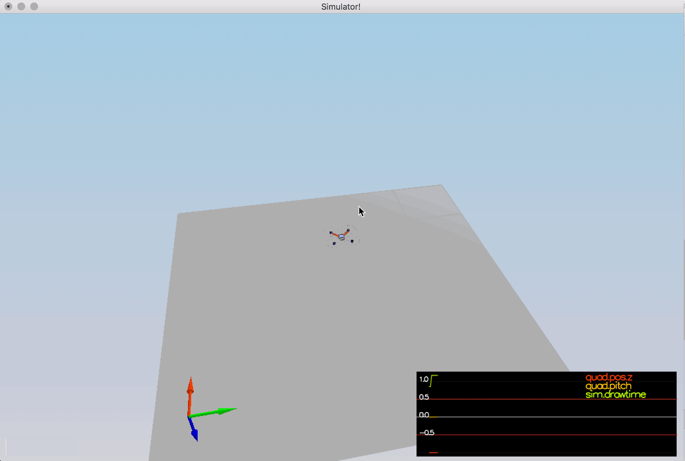
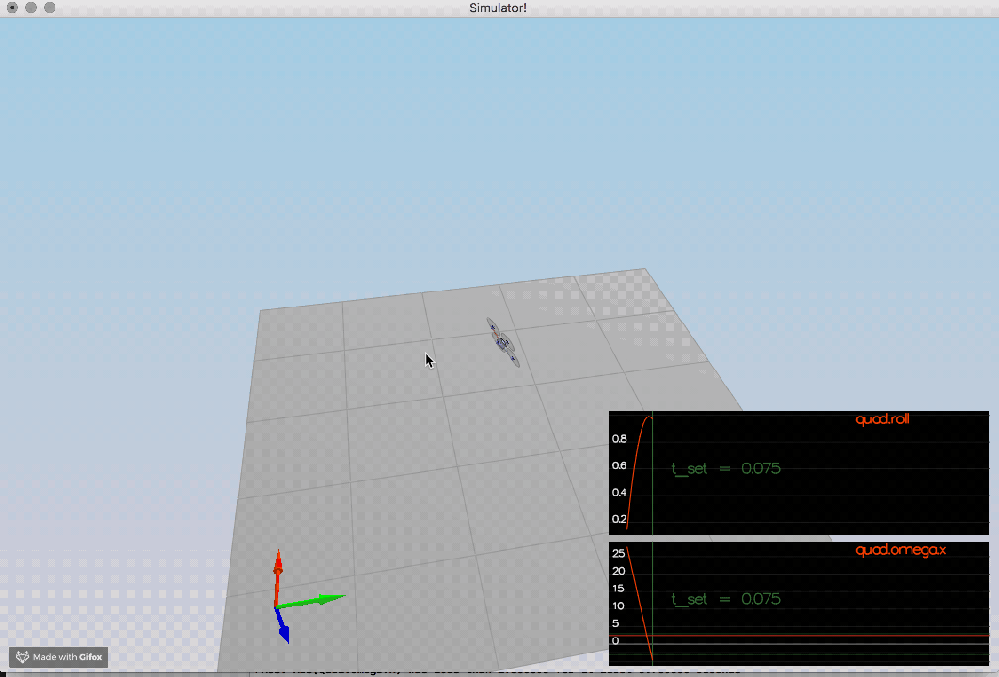
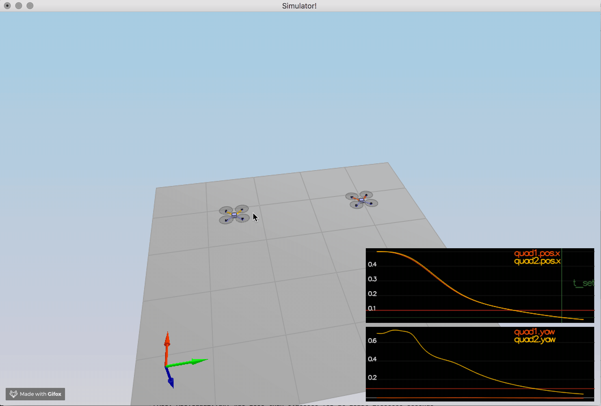
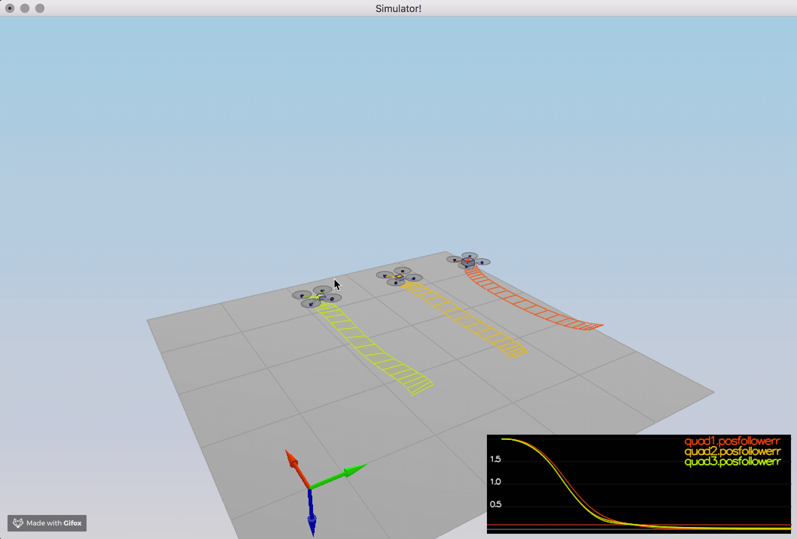
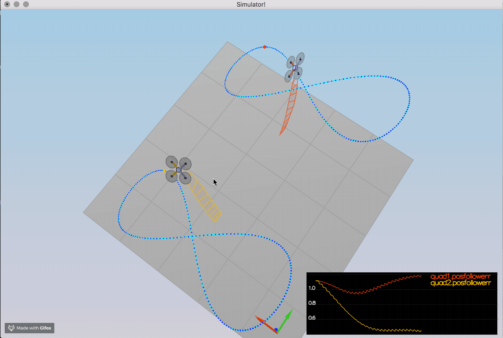
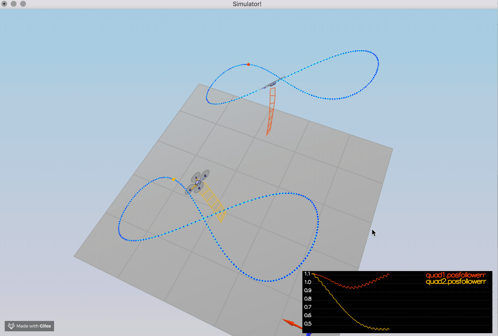

## Project: FCND Controls - Task , Implementations & Results

#### 1.(Scenario 1) - Introduction: open-loop hover

Adjust the mass of drone in [QuadControlParams.txt](config/QuadControlParams.txt) set to `Mass = 0.5`.

#### 2.Body rate and roll/pitch control (scenario 2)

  ##### I) Implement body rate control

Implementation of [GenerateMotorCommands()](src/QuadControl.cpp) method

    float l = L / sqrt(2.f);
    
    
    float th_X = momentCmd.x / l;
    float th_Y = momentCmd.y / l;
    float th_Z = -momentCmd.z / kappa;
    
    
    cmd.desiredThrustsN[0] = CONSTRAIN(((th_X + th_Y + th_Z + collThrustCmd)/4.f), minMotorThrust, maxMotorThrust); // front left
    cmd.desiredThrustsN[1] = CONSTRAIN(((-th_X + th_Y - th_Z + collThrustCmd)/4.f), minMotorThrust, maxMotorThrust); // front right
    cmd.desiredThrustsN[2] = CONSTRAIN(((th_X - th_Y - th_Z + collThrustCmd)/4.f), minMotorThrust, maxMotorThrust); // rear left
    cmd.desiredThrustsN[3] = CONSTRAIN(((-th_X - th_Y + th_Z + collThrustCmd)/4.f), minMotorThrust, maxMotorThrust); // rear right
    
Implementation of [BodyRateControl()](src/QuadControl.cpp) method

     momentCmd = V3F(Ixx, Iyy, Izz) * kpPQR * (pqrCmd - pqr);

  ##### II) Implement roll / pitch control

Implementation of [RollPitchControl()](src/QuadControl.cpp) method

      float c = - collThrustCmd / mass;
        float b_x_cmd = CONSTRAIN(accelCmd.x / c, -maxTiltAngle, maxTiltAngle);
        float b_x_err = b_x_cmd - R(0,2);
        float b_x_p_term = kpBank * b_x_err;
        
        float b_y_cmd = CONSTRAIN(accelCmd.y / c, -maxTiltAngle, maxTiltAngle);
        float b_y_err = b_y_cmd - R(1,2);
        float b_y_p_term = kpBank * b_y_err;
        
        pqrCmd.x = (R(1,0) * b_x_p_term - R(0,0) * b_y_p_term) / R(2,2);
        pqrCmd.y = (R(1,1) * b_x_p_term - R(0,1) * b_y_p_term) / R(2,2);

#### 3.Position/velocity and yaw angle control  (scenario 3) + 4.Non-idealities and robustness (scenario 4)

  ##### I) Lateral Position & Altitude Control

Implementation of [AltitudeControl()](src/QuadControl.cpp) method

    float z_err = posZCmd - posZ;
    float p = kpPosZ * z_err;
    
    float z_dot_err = velZCmd - velZ;
    float d = kpVelZ * z_dot_err + velZ;
    
    integratedAltitudeError += z_err * dt;
    float i = KiPosZ * integratedAltitudeError;
 
    
    float u_1_bar = p + d + i + accelZCmd;
    
    float z_acc = ( u_1_bar - CONST_GRAVITY ) /  R(2,2);
    
    thrust = - mass * CONSTRAIN(z_acc, - maxAscentRate / dt, maxAscentRate / dt);

Implementation of [LateralPositionControl()](src/QuadControl.cpp) method

    if(velCmd.mag() > maxSpeedXY) {
        velCmd = velCmd.norm() * maxSpeedXY;
    }
    
    accelCmd += (kpPosXY * (posCmd - pos)) + (kpVelXY * (velCmd - vel));
    
    if(accelCmd.mag() > maxAccelXY) {
        accelCmd = accelCmd.norm() * maxAccelXY;
    }

##### II) Yaw Control

Implementation of [YawControl()](src/QuadControl.cpp) method

    yawCmd = fmodf(yawCmd, 2.f*F_PI);
    
    
    float err = yawCmd - yaw;
    
    if ( err > F_PI ) {
        err -= 2.f * F_PI;
    }
    else if ( err < -F_PI ) {
        err += 2.f * F_PI;
    }
    
    yawRateCmd = kpYaw * err;

#### 5.Tracking trajectories  (scenario 5)

Tuning Results

#### 1.(Scenario 1) - Introduction: open-loop hover

    Simulation #1 (../config/1_Intro.txt)
    PASS: ABS(Quad.PosFollowErr) was less than 0.500000 for at least 0.800000 seconds

#### 2.Body rate and roll/pitch control (scenario 2)

    Simulation #248 (../config/2_AttitudeControl.txt)
    PASS: ABS(Quad.Roll) was less than 0.025000 for at least 0.750000 seconds
    PASS: ABS(Quad.Omega.X) was less than 2.500000 for at least 0.750000 seconds

#### 3.Position/velocity and yaw angle control  (scenario 3)

    Simulation #290 (../config/3_PositionControl.txt)
    PASS: ABS(Quad1.Pos.X) was less than 0.100000 for at least 1.250000 seconds
    PASS: ABS(Quad2.Pos.X) was less than 0.100000 for at least 1.250000 seconds
    PASS: ABS(Quad2.Yaw) was less than 0.100000 for at least 1.000000 seconds

#### 4.Non-idealities and robustness (scenario 4)

    Simulation #298 (../config/4_Nonidealities.txt)
    PASS: ABS(Quad1.PosFollowErr) was less than 0.100000 for at least 1.500000 seconds
    PASS: ABS(Quad2.PosFollowErr) was less than 0.100000 for at least 1.500000 seconds
    PASS: ABS(Quad3.PosFollowErr) was less than 0.100000 for at least 1.500000 seconds

#### 5.Tracking trajectories  (scenario 5)

    Simulation #303 (../config/5_TrajectoryFollow.txt)
    PASS: ABS(Quad2.PosFollowErr) was less than 0.250000 for at least 3.000000 seconds

    Simulation #316 (../config/X_TestMavlink.txt)
    PASS: ABS(Quad2.PosFollowErr) was less than 0.250000 for at least 3.000000 seconds

